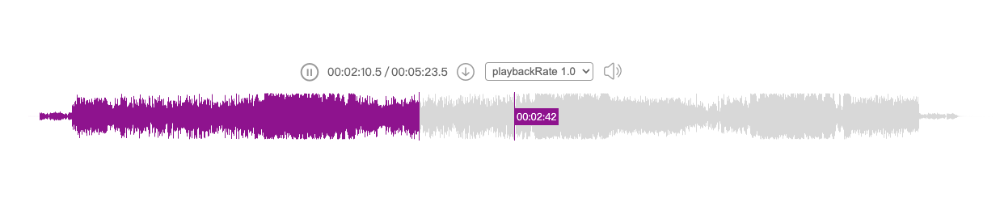

# react-audio-wave
A react component that visualizes a waveform of an audio file. Source code at [https://github.com/llaurora/react-audio-wave](https://github.com/llaurora/react-audio-wave).


## Installation
```shell
# if you prefer npm
npm install react-audio-wave

# if you prefer yarn
yarn add react-audio-wave

# if you prefer pnpm
pnpm add react-audio-wave
```

## Example
```tsx
const AudioPlayer = () => {
    {/* ... */}
    return (
        <div className="audio-player">
            {/* ... */}
            <ReactAudioWave
                supportPlaybackRate
                className="audio-wave-container"
                waveHeight={waveHeight}
                colors={colors}
                audioSrc={audioSrc}
                onChangeLoadState={onChangeLoadState}
                onCurrentTimeChange={onCurrentTimeChange}
                onPlayEnded={onPlayEnded}
                placeholder={Placeholder}
            />
        </div>
    );
};
```
Full code of the example, refer to the [example](https://github.com/llaurora/react-audio-wave/tree/main/example)

## Props
For the interface definition, please refer to the [API documentation](https://github.com/llaurora/react-audio-wave/tree/main/docs/API.md)
```tsx
interface ReactAudioWaveProps {
    waveHeight: number;
    colors: Wavecolors;
    audioSrc: string;
    placeholder: PropsWithChildren<any>;
    emptyElement?: ReactElement;
    barGap?: number;
    barWidth?: number;
    progressStyle?: CSSProperties;
    supportPlaybackRate?: boolean;
    mono?: boolean;
    progressCursorVisible?: boolean;
    cursorVisible?: boolean;
    cursorTimeConfig?: CursorTimeConfig;
    className?: string;
    timeFormat?: (seconds: number) => string;
    onChangeLoadState?: (state: LoadStateEnum, duration?: number) => void;
    onCurrentTimeChange?: (current: number) => void;
    onWaveSizeChange?: (size: Size) => void;
    onPlayEnded?: () => void;
    renderErrorElement?: (error?: string) => ReactElement;
}
```

